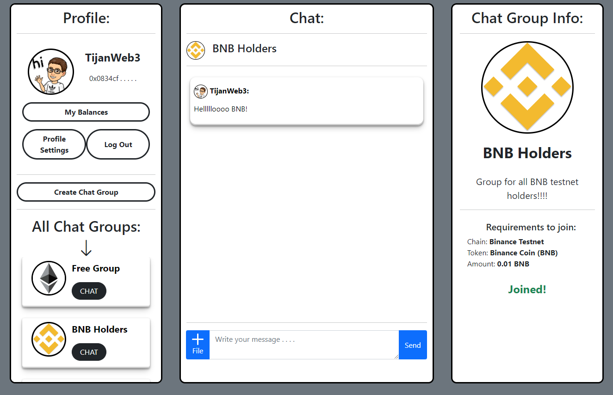

# Simple Chat
Simple Chat is decentralized application, where anyone can create a chat group with some limitations based on user's token balance or NFTs. Anyone can join any chat group as long as they meet its requirements, for example: I can create a chat group for BAYC holders and anyone holding at least 1 BAYC will be able to join and chat. This project was built in a 7-day Moralis programming challenge.

Please leave a ⭐ if you like it.

## Technologies
I used [Moralis](https://moralis.io/) for storing messages, groups, users, authentication and their Web3API for getting users' token and NFT balances.

It was built with vanilla JavaScript.

## License
[MIT](https://choosealicense.com/licenses/mit/)
